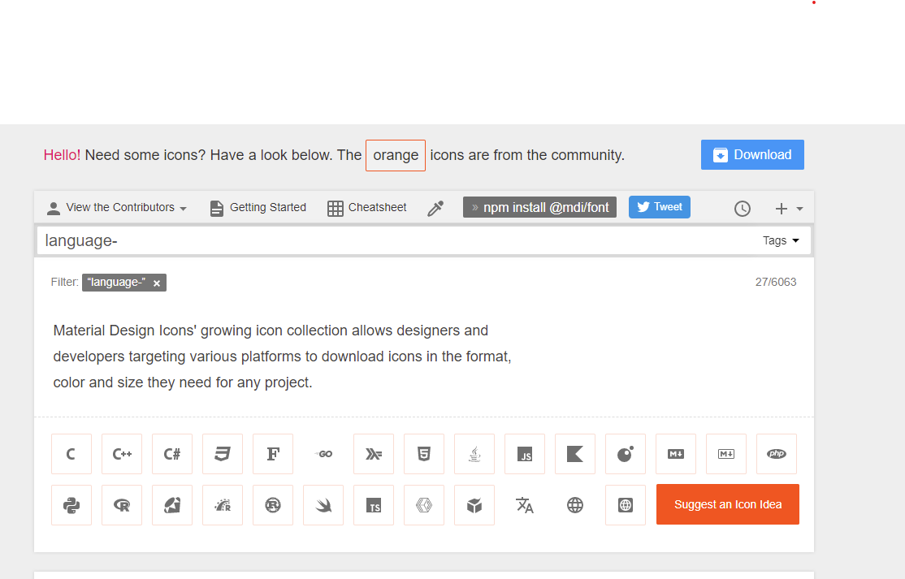

### Navbar With Icons with KivyMD

- [mMterial.io](https://material.io/design)

- [KivyMD Github](https://github.com/kivymd/KivyMD)

- [Icons](https://zavoloklom.github.io/material-design-iconic-font/index.html)

<table align="center">
  <tr>
    <td align="center" style="padding=0;width=50%;">
      
    </td>
  </tr>
</table>

**Crear KivyMd**

```
git clone https://github.com/kivymd/KivyMD.git --depth 1
cd KivyMD
pip install .
```

**Activar**
Crear Entorno Kivy

```
python -m venv virt
source virt/Scrips/activate
```

**Pasos detallados**

## Intro To KivyMD Installation

[https://material.io/design]


_Crear Entorno Kivy_

- create File kivymd
- Ingresar el comando: cd kivymd/
- python -m venv virt
- Ingresar al siguiente direccion: `virt/Scrips/activate`

---

_Instalar librerias necesarioas_

- python -m pip install --upgrade pip
- pip install pillow
- pip install kivy
- pip freeze

---

_Clonar Archivo de github_

- git clone https://github.com/kivymd/KivyMD.git --depth 1

---

_Instalar_

- cd KivyMD
- pip install .

---

_Ejecutar_

- cd demos
- cd kitchen_sink
- python main.py


**Icons**

[Material Desgign](https://materialdesignicons.com/)

<table align="center">
  <tr>
    <td align="center" style="padding=0;width=50%;">
      
    </td>
  </tr>
</table>
