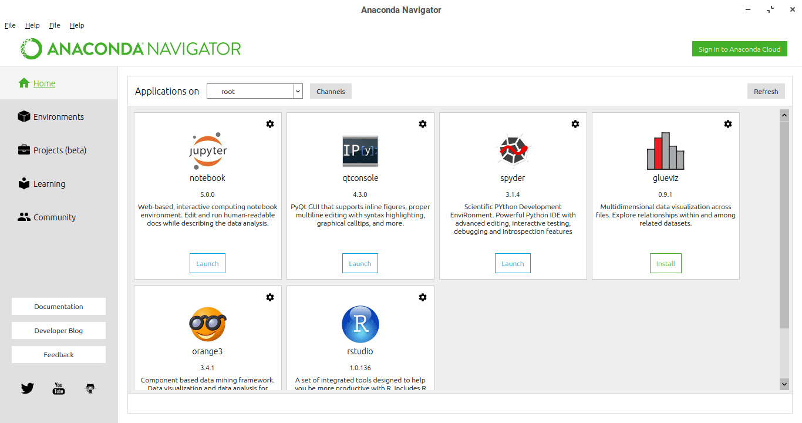
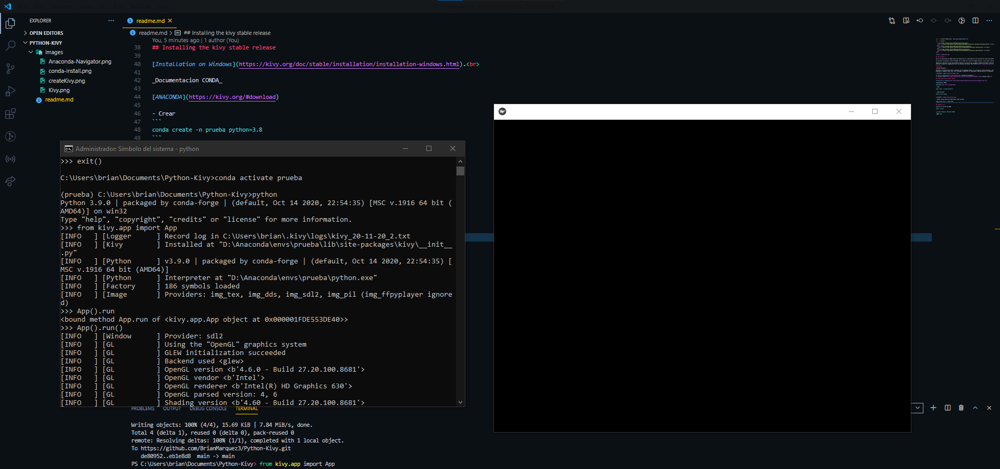

<h2 align="center">Python Kivy - kivy &nbsp;:heart:&nbsp;</h2>

<p align="center">
  
  <a href="https://github.com/BrianMarquez3/Python-Kivy/tags">
    
  </a>
  <a href="https://github.com/BrianMarquez3/Python-Kivy/stargazers">
    
  </a>
  <a href="https://github.com/BrianMarquez3/Python-Kivy/network">
    
  </a>
</p>
  


## ¿Que es Kiby? 💻

Kivy es una biblioteca de código abierto de Python para el rápido desarrollo de interfaces de usuario multiplataforma. Las aplicaciones Kivy se pueden desarrollar para Linux, Windows, OS X, Android e iOS usando el mismo código base.

Los gráficos se procesan a través de OpenGL ES 2 en lugar de a través de widgets nativos, lo que lleva a una apariencia bastante uniforme en todos los sistemas operativos.

Desarrollar interfaces en Kivy opcionalmente implica el uso de kvlang, un pequeño lenguaje que admite expresiones similares a python e interoperabilidad de python. El uso de kvlang puede simplificar drásticamente el desarrollo de la interfaz de usuario en comparación con el uso exclusivo de Python. [RIPTUTORIAL](https://riptutorial.com/es/kivy).<br>

## Anaconda

_Anaconda Navigator_

Anaconda es un distribución libre y abierta1​ de los lenguajes Python y R, utilizada en ciencia de datos, y aprendizaje automático (machine learning). Esto incluye procesamiento de grandes volúmenes de información, análisis predictivo y cómputos científicos. Está orientado a simplificar el despliegue y administración de los paquetes de software. [WIKIPEDIA](https://es.wikipedia.org/wiki/Anaconda_(distribuci%C3%B3n_de_Python)).<br>



📦 [Install Anaconda](https://www.anaconda.com/) Intalador de Anaconda.<br>
📦 [Comandos CONDA](https://www.interactivechaos.com/recursos-educativos/comandos-conda) Comandos Conda.<br>

## Installing the kivy stable release

[Installation on Windows](https://kivy.org/doc/stable/installation/installation-windows.html).<br>

_Documentacion CONDA_

[ANACONDA](https://kivy.org/#download)

- Crear
```
conda create -n prueba python=3.8
```

- Conda Activate
```
conda activate prueba
```


- Install using conda with conda-forge: conda activate 
```
conda install kivy -c conda-forge
```

## Ejecutar Primera Ventana

- Conda Activate
```
conda activate prueba
```
- Ejecutar Shell
```
python
```
- Run
```
App().run()
```
-Ventana de Ejecucion_

## Comandos 🧑‍💻

_Verifica la versión de CONDA_
```
conda --version
````

_Listado de Modulos instalados CONDA_
```
CONDA list
````

_Borrar Modulos Instalados_
```
CONDA remove nombreModulo
````

_ver las Cartepa env_
```
conda env list
````

