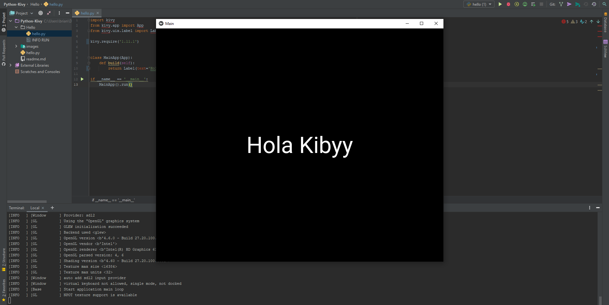

<h2 align="center">Python Kivy - kivy &nbsp;:computer:&nbsp;</h2>

<p align="center">
  
   </a>
    
  </a>
  <a href="https://github.com/BrianMarquez3/Python-Kivy/stargazers">
    
  </a>
  <a href="https://github.com/BrianMarquez3/Python-Kivy/network">
    
  </a>
    
  </a>
  
  </a>
    
  </a>
  
  </a>
    
  </a>
  
   </a>
   <a href="https://github.com/BrianMarquez3/Python-Kivy/network">
    
  </a><br>
 
  
  


## Tabla de Contenidos

| Numeration   | Check  |Topic          |Quantization      |        link       |
| ------------ |--------|-------------- |----------------- |------------------ |

| 001      |:heavy_check_mark: | [Input Boxes and Buttons](https://github.com/BrianMarquez3/Python-Kivy/tree/main/001%20Input%20Boxes%20and%20Buttons)    | :hourglass:     | [ ⬅️ Atras](https://github.com/BrianMarquez3) | 
| 002     |:heavy_check_mark: | [Button Column Span Trick](https://github.com/BrianMarquez3/Python-Kivy/tree/main/002%20Button%20Column%20Span%20Trick)    |   :hourglass:     | [ ⬅️ Atras](https://github.com/BrianMarquez3) | 
| 003     |:heavy_check_mark: | [How To Set The Height And Width of Widgets](https://github.com/BrianMarquez3/Python-Kivy/tree/main/003%20How%20To%20Set%20The%20Height%20And%20Width%20of%20Widgets)    | | :hourglass:     | [ ⬅️ Atras](https://github.com/BrianMarquez3) | 
| 004     |:heavy_check_mark: | [Kivy Design Lenguaje](https://github.com/BrianMarquez3/Python-Kivy/tree/main/004%20Kivy%20Design%20Lenguaje) | :hourglass:     | [ ⬅️ Atras](https://github.com/BrianMarquez3) | 
| 005     |:heavy_check_mark: | [The Kivy Builder](https://github.com/BrianMarquez3/Python-Kivy/tree/main/005%20The%20Kivy%20Builder) | :hourglass:     | [ ⬅️ Atras](https://github.com/BrianMarquez3) | 
| 006    |:heavy_check_mark: | [Changing Kivy Button Colors](https://github.com/BrianMarquez3/Python-Kivy/tree/main/006%20Changing%20Kivy%20Button%20Colors) || :hourglass:     | [ ⬅️ Atras](https://github.com/BrianMarquez3) | 
| 007    |:heavy_check_mark: | [Kivy Box Layout](https://github.com/BrianMarquez3/Python-Kivy/tree/main/007%20Kivy%20Box%20Layout) | :hourglass:     | [ ⬅️ Atras](https://github.com/BrianMarquez3) | 
| 008    |:heavy_check_mark: | [Setting Default Widget Properties](https://github.com/BrianMarquez3/Python-Kivy/tree/main/008%20Setting%20Default%20Widget%20Properties) | :hourglass:     | [ ⬅️ Atras](https://github.com/BrianMarquez3) | 
| 009    |:heavy_check_mark: | [Change Background Color And Text Color of Labels](https://github.com/BrianMarquez3/Python-Kivy/tree/main/009%20Change%20Background%20Color%20And%20Text%20Color%20of%20Labels) | :hourglass:     | [ ⬅️ Atras](https://github.com/BrianMarquez3) | 
| 010    |:heavy_check_mark:✔️ | [Two Ways To Change Background Colors](https://github.com/BrianMarquez3/Python-Kivy/blob/main/010%20Two%20Ways%20To%20Change%20Background%20Colors/readme.md) | :hourglass:     | [ ⬅️ Atras](https://github.com/BrianMarquez3) | 
| 011    |:heavy_check_mark: | [How To Use Images With Kivy](https://github.com/BrianMarquez3/Python-Kivy/tree/main/011%20How%20To%20Use%20Images%20With%20Kivy) | :hourglass:     | [ ⬅️ Atras](https://github.com/BrianMarquez3) | 
| 012    |:heavy_check_mark: | [Kivy Float Layout](https://github.com/BrianMarquez3/Python-Kivy/tree/main/012%20Kivy%20Float%20Layout) | :hourglass:     | [ ⬅️ Atras](https://github.com/BrianMarquez3) | 
| 013    |:heavy_check_mark: | [How To Update Labels](https://github.com/BrianMarquez3/Python-Kivy/tree/main/013%20How%20To%20Update%20Labels) | :hourglass:     | [ ⬅️ Atras](https://github.com/BrianMarquez3) | 
| 014    |:heavy_check_mark: | [Build A Simple Calculator App](https://github.com/BrianMarquez3/Python-Kivy/tree/main/014%20Build%20A%20Simple%20Calculator%20App) | :hourglass:     | [ ⬅️ Atras](https://github.com/BrianMarquez3) | 
| 015    |:heavy_check_mark: | [Calculator Addition Function](https://github.com/BrianMarquez3/Python-Kivy/tree/main/015%20Calculator%20Addition%20Function) | :hourglass:     | [ ⬅️ Atras](https://github.com/BrianMarquez3) | 
| 016    |:heavy_check_mark: | [Secondary Calculator Button Functions](https://github.com/BrianMarquez3/Python-Kivy/tree/main/016%20Secondary%20Calculator%20Button%20Functions) | :hourglass:     | [ ⬅️ Atras](https://github.com/BrianMarquez3) | 
| 017    |:heavy_check_mark: | [Fix Our Decimal Calculator Problem](https://github.com/BrianMarquez3/Python-Kivy/tree/main/017%20Fix%20Our%20Decimal%20Calculator%20Problem) | :hourglass:     | [ ⬅️ Atras](https://github.com/BrianMarquez3) | 

## Que es Kiby

Kivy es una biblioteca de código abierto de Python para el rápido desarrollo de interfaces de usuario multiplataforma. Las aplicaciones Kivy se pueden desarrollar para Linux, Windows, OS X, Android e iOS usando el mismo código base.

Los gráficos se procesan a través de OpenGL ES 2 en lugar de a través de widgets nativos, lo que lleva a una apariencia bastante uniforme en todos los sistemas operativos.

Desarrollar interfaces en Kivy opcionalmente implica el uso de kvlang, un pequeño lenguaje que admite expresiones similares a python e interoperabilidad de python. El uso de kvlang puede simplificar drásticamente el desarrollo de la interfaz de usuario en comparación con el uso exclusivo de Python. [RIPTUTORIAL](https://riptutorial.com/es/kivy).<br>

## Anaconda

_Anaconda Navigator_

Anaconda es un distribución libre y abierta1​ de los lenguajes Python y R, utilizada en ciencia de datos, y aprendizaje automático (machine learning). Esto incluye procesamiento de grandes volúmenes de información, análisis predictivo y cómputos científicos. Está orientado a simplificar el despliegue y administración de los paquetes de software. [WIKIPEDIA](https://es.wikipedia.org/wiki/Anaconda_(distribuci%C3%B3n_de_Python)).<br>


📦 [Install Anaconda](https://www.anaconda.com/) Intalador de Anaconda.<br>
📦 [Comandos CONDA](https://www.interactivechaos.com/recursos-educativos/comandos-conda) Comandos Conda.<br>

## Installing the kivy stable release

[Installation on Windows](https://kivy.org/doc/stable/installation/installation-windows.html).<br>

_Documentacion CONDA_

[ANACONDA](https://kivy.org/#download)<br>
 _Los Comandos se deben usar con modo Administrador_
- Crear
```
conda create -n prueba python=3.8
```
_Los Archivos se Almacena en el disco C:\Users\brian\conda\envs_

- Conda Activate
```
conda activate prueba
```


- Install using conda with conda-forge: conda activate 
```
conda install kivy -c conda-forge
```

## Ejecutar Primera Ventana

- Conda Activate
```
conda activate prueba
```
- Ejecutar Shell
```
python
```
- Run
```
App().run()
```
_Ventana de Ejecucion_

## Comandos

_Verifica la versión de CONDA_
```
conda --version
````

_Listado de Modulos instalados CONDA_
```
CONDA list
````

_Borrar Modulos Instalados_
```
CONDA remove nombreModulo
````

_ver los Entornos env_
```
conda env list
````

_Borrar entornos env_
```
conda env remove n entornos
````

## HELLO



## Paypal

🩸 Hacer una donación [PAYPAL](https://www.paypal.com/donate?hosted_button_id=98U3T62494H9Y) 🍵
