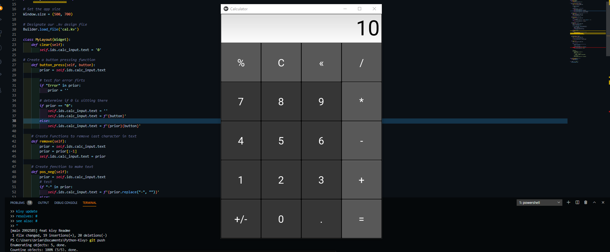
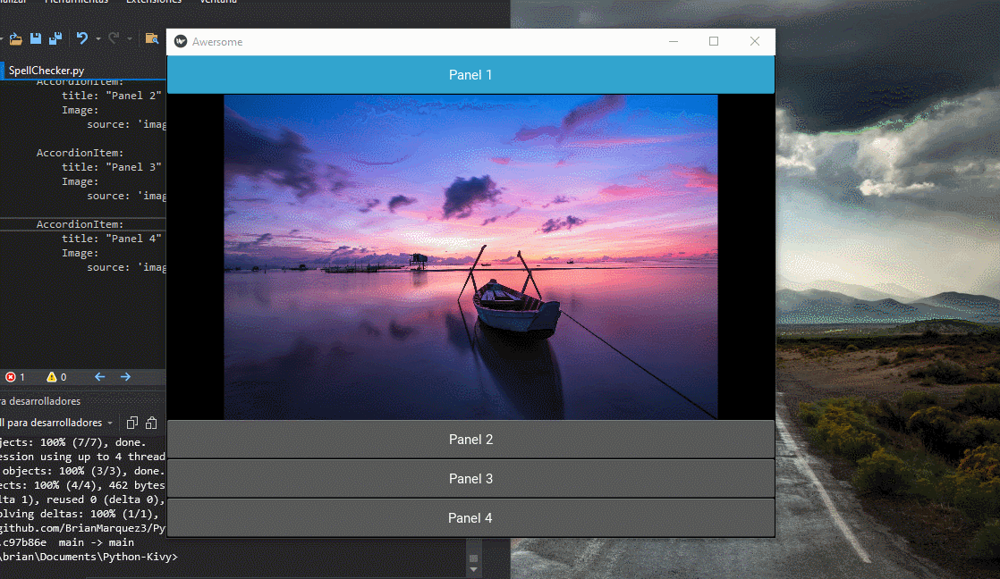
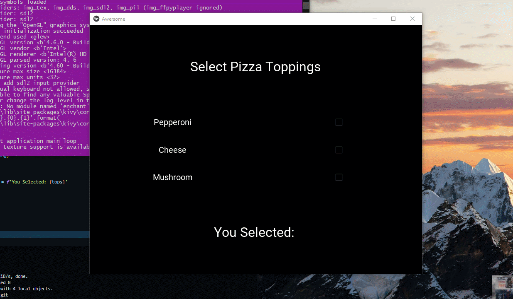
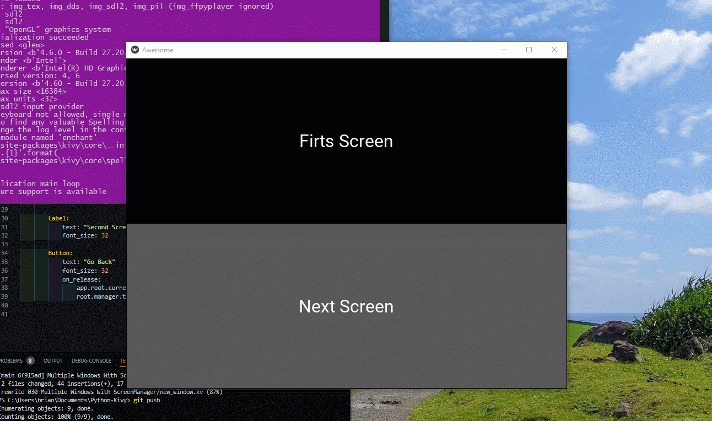
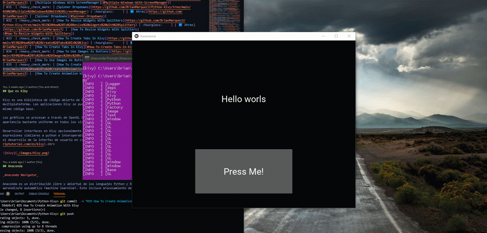
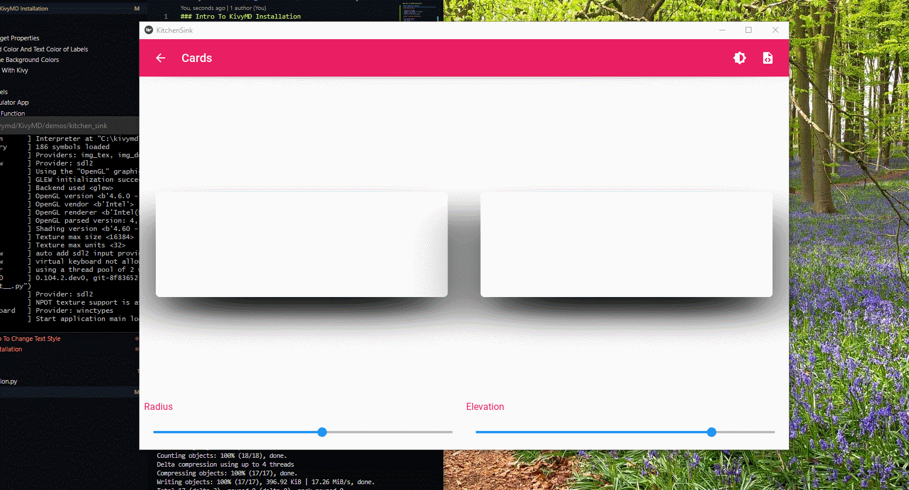
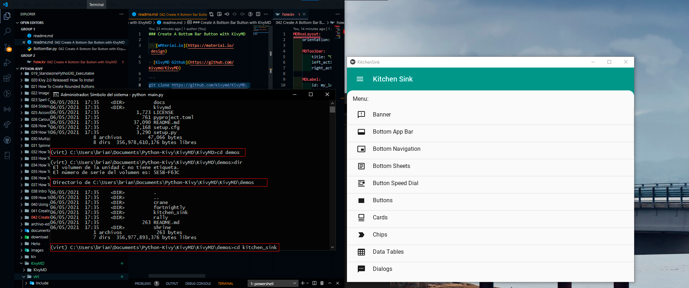
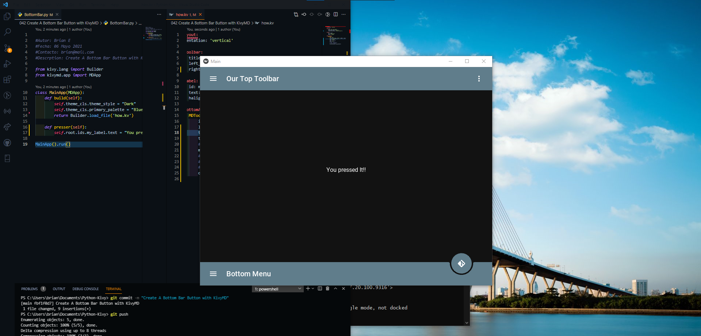

<h2 align="center"> Kivy | Open source Python framework</h2>

<p align="center">
  
   </a>
    
  </a>
  <a href="https://github.com/BrianMarquez3/Python-Kivy/stargazers">
    
  </a>
  <a href="https://github.com/BrianMarquez3/Python-Kivy/network">
    
  </a>
    
  </a>
  
  </a>
    
  </a>
  
  </a>
    
  </a>
  
   </a>
   <a href="https://github.com/BrianMarquez3/Python-Kivy/network">
    
  </a><br>
 
  
  

<!--  -->

<table align="center">
  <tr>
    <td align="center" style="padding=0;width=50%;">
      
    </td>
  </tr>
</table>

## Tabla de Contenidos

| Numeration   |     Check  | Topic                                                                                                                   | Quantization     |        Atras       | Info             |
| ------------ |------------|------------------------------------------------------------------------------------------------------------------------ |----------------- |------------------ |------------------ |
| 001  | :heavy_check_mark: | [Input Boxes and Buttons](https://github.com/BrianMarquez3/Python-Kivy/tree/main/001%20Input%20Boxes%20and%20Buttons)    | :hourglass:     | [ ⬅️ Atras](https://github.com/BrianMarquez3) |  - |
| 002  | :heavy_check_mark: | [Button Column Span Trick](https://github.com/BrianMarquez3/Python-Kivy/tree/main/002%20Button%20Column%20Span%20Trick)    |   :hourglass:     | [ ⬅️ Atras](https://github.com/BrianMarquez3) | - |
| 003  | :heavy_check_mark: | [How To Set The Height And Width of Widgets](https://github.com/BrianMarquez3/Python-Kivy/tree/main/003%20How%20To%20Set%20The%20Height%20And%20Width%20of%20Widgets)    |  :hourglass:     | [ ⬅️ Atras](https://github.com/BrianMarquez3) | - |
| 004  | :heavy_check_mark: | [Kivy Design Lenguaje](https://github.com/BrianMarquez3/Python-Kivy/tree/main/004%20Kivy%20Design%20Lenguaje) | :hourglass:     | [ ⬅️ Atras](https://github.com/BrianMarquez3) | - |
| 005  | :heavy_check_mark: | [The Kivy Builder](https://github.com/BrianMarquez3/Python-Kivy/tree/main/005%20The%20Kivy%20Builder) | :hourglass:     | [ ⬅️ Atras](https://github.com/BrianMarquez3) | - |
| 006  | :heavy_check_mark: | [Changing Kivy Button Colors](https://github.com/BrianMarquez3/Python-Kivy/tree/main/006%20Changing%20Kivy%20Button%20Colors) | :hourglass:     | [ ⬅️ Atras](https://github.com/BrianMarquez3) | - |
| 007  | :heavy_check_mark: | [Kivy Box Layout](https://github.com/BrianMarquez3/Python-Kivy/tree/main/007%20Kivy%20Box%20Layout) | :hourglass:     | [ ⬅️ Atras](https://github.com/BrianMarquez3) | - |
| 008  | :heavy_check_mark: | [Setting Default Widget Properties](https://github.com/BrianMarquez3/Python-Kivy/tree/main/008%20Setting%20Default%20Widget%20Properties) | :hourglass:     | [ ⬅️ Atras](https://github.com/BrianMarquez3) | - |
| 009  | :heavy_check_mark: | [Change Background Color And Text Color of Labels](https://github.com/BrianMarquez3/Python-Kivy/tree/main/009%20Change%20Background%20Color%20And%20Text%20Color%20of%20Labels) | :hourglass:     | [ ⬅️ Atras](https://github.com/BrianMarquez3) | - |
| 010  | :heavy_check_mark: | [Two Ways To Change Background Colors](https://github.com/BrianMarquez3/Python-Kivy/blob/main/010%20Two%20Ways%20To%20Change%20Background%20Colors/readme.md) | :hourglass:     | [ ⬅️ Atras](https://github.com/BrianMarquez3) | - |
| 011  | :heavy_check_mark: | [How To Use Images With Kivy](https://github.com/BrianMarquez3/Python-Kivy/tree/main/011%20How%20To%20Use%20Images%20With%20Kivy) | :hourglass:     | [ ⬅️ Atras](https://github.com/BrianMarquez3) | - |
| 012  | :heavy_check_mark: | [Kivy Float Layout](https://github.com/BrianMarquez3/Python-Kivy/tree/main/012%20Kivy%20Float%20Layout) | :hourglass:     | [ ⬅️ Atras](https://github.com/BrianMarquez3) | - |
| 013  | :heavy_check_mark: | [How To Update Labels](https://github.com/BrianMarquez3/Python-Kivy/tree/main/013%20How%20To%20Update%20Labels) | :hourglass:     | [ ⬅️ Atras](https://github.com/BrianMarquez3) | - |
| 014  | :heavy_check_mark: | [Build A Simple Calculator App](https://github.com/BrianMarquez3/Python-Kivy/tree/main/014%20Build%20A%20Simple%20Calculator%20App) | :hourglass:     | [ ⬅️ Atras](https://github.com/BrianMarquez3) | - |
| 015  | :heavy_check_mark: | [Calculator Addition Function](https://github.com/BrianMarquez3/Python-Kivy/tree/main/015%20Calculator%20Addition%20Function) | :hourglass:     | [ ⬅️ Atras](https://github.com/BrianMarquez3) | - |
| 016  | :heavy_check_mark: | [Secondary Calculator Button Functions](https://github.com/BrianMarquez3/Python-Kivy/tree/main/016%20Secondary%20Calculator%20Button%20Functions) | :hourglass:     | [ ⬅️ Atras](https://github.com/BrianMarquez3) | - |
| 017  | :heavy_check_mark: | [Fix Our Decimal Calculator Problem](https://github.com/BrianMarquez3/Python-Kivy/tree/main/017%20Fix%20Our%20Decimal%20Calculator%20Problem) | :hourglass:     | [ ⬅️ Atras](https://github.com/BrianMarquez3) | - |
| 018  | :heavy_check_mark: | [Math Calculator Buttons With eval](https://github.com/BrianMarquez3/Python-Kivy/tree/main/018%20Math%20Calculator%20Buttons%20With%20eval()) | :hourglass:     | [ ⬅️ Atras](https://github.com/BrianMarquez3) | [Standalone Python EXE Executable](#Math-Calculator-Buttons-With-eval) |
| 019  | :heavy_check_mark: | [Standalone Pytho EXE Executable](https://github.com/BrianMarquez3/Python-Kivy/tree/main/019_StandalonePythoEXE_Executable) | :hourglass:     | [ ⬅️ Atras](https://github.com/BrianMarquez3) | [Standalone Python EXE Executable](#Standalone-Python-EXE-Executable) |
| 020  | :heavy_check_mark: | [Kivy 2 0 Released! How To Install](https://github.com/BrianMarquez3/Python-Kivy/tree/main/020%20Kivy%202.0%20Released!%20How%20To%20Install) | :hourglass:     | [ ⬅️ Atras](https://github.com/BrianMarquez3) |  [Kivy 2 0 Released! How To Install](#Kivy-2-0-Released!-How-To-Install)|
| 021  | :heavy_check_mark: | [Image Viewer With FileChooserIconView and FileChooserListView](https://github.com/BrianMarquez3/Python-Kivy/tree/main/022%20Image%20Viewer%20With%20FileChooserIconView%20and%20FileChooserListView) | :hourglass:     | [ ⬅️ Atras](https://github.com/BrianMarquez3) |  [Image Viewer With FileChooserIconView and FileChooserListView](#Image-Viewer-With-FileChooserIconView-and-FileChooserListView)|
| 023  | :heavy_check_mark: | [Spell ChecketView](https://github.com/BrianMarquez3/Python-Kivy/tree/main/023%20Spell%20Checker) | :hourglass:     | [ ⬅️ Atras](https://github.com/BrianMarquez3) |   [Spell ChecketView](#Spell-ChecketView)|
| 024  | :heavy_check_mark: | [Sliders For Kivy](https://github.com/BrianMarquez3/Python-Kivy/tree/main/024%20Sliders%20For%20Kivy) | :hourglass:     | [ ⬅️ Atras](https://github.com/BrianMarquez3) |  [Sliders For Kivy](#Sliders-For-Kivy)|
| 025  | :heavy_check_mark: | [Accordions For Kivy](https://github.com/BrianMarquez3/Python-Kivy/tree/main/025%20Accordions%20For%20Kivy) | :hourglass:     | [ ⬅️ Atras](https://github.com/BrianMarquez3) |  [Accordions For Kivy](#Accordions-For-Kivy)|
| 026  | :heavy_check_mark: | [Carousels For Kivy](https://github.com/BrianMarquez3/Python-Kivy/tree/main/026%20Carousels%20For%20Kivy) | :hourglass:     | [ ⬅️ Atras](https://github.com/BrianMarquez3) |  [Carousels For Kivy](#Carousels-For-Kivy)|
| 027  | :heavy_check_mark: | [How To Create CheckBoxes](https://github.com/BrianMarquez3/Python-Kivy/tree/main/027%20How%20To%20Create%20CheckBoxes) | :hourglass:     | [ ⬅️ Atras](https://github.com/BrianMarquez3) |  [How To Create CheckBoxes](#How-To-Create-CheckBoxes)|
| 028  | :heavy_check_mark: | [How To Create Radio Buttons](https://github.com/BrianMarquez3/Python-Kivy/tree/main/028%20How%20To%20Create%20Radio%20Buttons) | :hourglass:     | [ ⬅️ Atras](https://github.com/BrianMarquez3) |  [How To Create Radio Buttons](#How-To-Create-Radio-Buttons)|
| 029  | :heavy_check_mark: | [How To Create Popup Boxes](https://github.com/BrianMarquez3/Python-Kivy/tree/main/029%20How%20To%20Create%20Popup%20Boxes) | :hourglass:     | [ ⬅️ Atras](https://github.com/BrianMarquez3) |  [How To Create Popup Boxes](#How-To-Create-Popup-Boxes)|
| 030  | :heavy_check_mark: | [Multiple Windows With ScreenManager](https://github.com/BrianMarquez3/Python-Kivy/tree/main/030%20Multiple%20Windows%20With%20ScreenManager) | :hourglass:     | [ ⬅️ Atras](https://github.com/BrianMarquez3) |  [Multiple Windows With ScreenManager](#Multiple-Windows-With-ScreenManager)|
| 031  | :heavy_check_mark: | [Spinner Dropdowns](https://github.com/BrianMarquez3/Python-Kivy/tree/main/030%20Multiple%20Windows%20With%20ScreenManager) | :hourglass:     | [ ⬅️ Atras](https://github.com/BrianMarquez3) |  [Spinner Dropdowns](#Spinner-Dropdowns)|
| 032  | :heavy_check_mark: | [How To Resize Widgets With Splitters](https://github.com/BrianMarquez3/Python-Kivy/tree/main/032%20How%20To%20Resize%20Widgets%20With%20Splitters) | :hourglass:     | [ ⬅️ Atras](https://github.com/BrianMarquez3) |  [How To Resize Widgets With Splitters](#How-To-Resize-Widgets-With-Splitters)|
| 033  | :heavy_check_mark: | [How To Create Tabs In Kivy](https://github.com/BrianMarquez3/Python-Kivy/tree/main/033%20How%20To%20Create%20Tabs%20In%20Kivy) | :hourglass:     | [ ⬅️ Atras](https://github.com/BrianMarquez3) |  [How To Create Tabs In Kivy](#How-To-Create-Tabs-In-Kivy)|
| 034  | :heavy_check_mark: | [How To Use Images As Buttons](https://github.com/BrianMarquez3/Python-Kivy/tree/main/034%20How%20To%20Use%20Images%20As%20Buttons) | :hourglass:     | [ ⬅️ Atras](https://github.com/BrianMarquez3) |  [How To Use Images As Buttons](#How-To-Use-Images-As-Buttons)|
| 035  | :heavy_check_mark: | [How To Create Animation With Kivy](https://github.com/BrianMarquez3/Python-Kivy/tree/main/035%20How%20To%20Create%20Animation%20With%20Kivy) | :hourglass:     | [ ⬅️ Atras](https://github.com/BrianMarquez3) |  [How To Create Animation With Kivy](#How-To-Create-Animation-With-Kivy)|
| 036  | :heavy_check_mark: | [ How To Create a Switch With Kivy](https://github.com/BrianMarquez3/Python-Kivy/tree/main/036%20How%20To%20Create%20a%20Switch%20With%20Kivy) | :hourglass:     | [ ⬅️ Atras](https://github.com/BrianMarquez3) |  [ How To Create a Switch With Kivy](#How-To-Create-a-Switch-With-Kivy)|
| 037  | :heavy_check_mark: | [ How To Use Markup To Change Text Style](https://github.com/BrianMarquez3/Python-Kivy/tree/main/037%20How%20To%20Use%20Markup%20To%20Change%20Text%20Style) | :hourglass:     | [ ⬅️ Atras](https://github.com/BrianMarquez3) |  [ How To Use Markup To Change Text Style](#How-To-Use-Markup-To-Change-Text-Style)|
| 038  | :heavy_check_mark: | [ Intro To KivyMD Installation](https://github.com/BrianMarquez3/Python-Kivy/tree/main/038%20Intro%20To%20KivyMD%20Installation) | :hourglass:     | [ ⬅️ Atras](https://github.com/BrianMarquez3) |  [ Intro To KivyMD Installation](#Intro-To-KivyMD-Installation)|
| 039  | :heavy_check_mark: | [How To Teach Yourself KivyMD Quickly](https://github.com/BrianMarquez3/Python-Kivy/tree/main/039%20How%20To%20Teach%20Yourself%20KivyMD%20Quickly) | :hourglass:     | [ ⬅️ Atras](https://github.com/BrianMarquez3) |  [ How To Teach Yourself KivyMD Quickly](#How-To-Teach-Yourself-KivyMD-Quickly)|
| 040  | :heavy_check_mark: | [Using Color Themes For KivyMD](https://github.com/BrianMarquez3/Python-Kivy/tree/main/040%20Using%20Color%20Themes%20For%20KivyMD) | :hourglass:     | [ ⬅️ Atras](https://github.com/BrianMarquez3) |  [ Using Color Themes For KivyMD](#Using-Color-Themes-For-KivyMD)|
| 041  | :heavy_check_mark: | [Creating A Login Screen With KivyMD](https://github.com/BrianMarquez3/Python-Kivy/tree/main/041%20Creating%20A%20Login%20Screen%20With%20KivyMD) | :hourglass:     | [ ⬅️ Atras](https://github.com/BrianMarquez3) |  [ Creating A Login Screen With KivyMD](#Creatin-A-Login-Screen-With-KivyMD)|
| 042  | :heavy_check_mark: | [Create A Bottom Bar Button with KivyMD](https://github.com/BrianMarquez3/Python-Kivy/tree/main/042%20Create%20A%20Bottom%20Bar%20Button%20with%20KivyMD) | :hourglass:     | [ ⬅️ Atras](https://github.com/BrianMarquez3) |  [Create A Bottom Bar Button with KivyMD](#Create-A-Bottom-Bar-Button-with-KivyMD)|
| 043  | :heavy_check_mark: | [Navbar With Icons with KivyMD](https://github.com/BrianMarquez3/Python-Kivy/tree/main/043%20Navbar%20With%20Icons%20with%20KivyMD) | :hourglass:     | [ ⬅️ Atras](https://github.com/BrianMarquez3) |  [Navbar With Icons with KivyMD](#Navbar-With-Icons-with-KivyMD)|
| 044  | :heavy_check_mark: | [Speed Dial Button Menu Wih KivyMD](https://github.com/BrianMarquez3/Python-Kivy/tree/main/043%20Navbar%20With%20Icons%20with%20KivyMD) | :hourglass:     | [ ⬅️ Atras](https://github.com/BrianMarquez3) |  [Speed Dial Button Menu Wih KivyMD](#Speed-Dial-Button-Menu-Wih-KivyMD)|

## Que es Kiby

Kivy es una biblioteca de código abierto de Python para el rápido desarrollo de interfaces de usuario multiplataforma. Las aplicaciones Kivy se pueden desarrollar para Linux, Windows, OS X, Android e iOS usando el mismo código base.

Los gráficos se procesan a través de OpenGL ES 2 en lugar de a través de widgets nativos, lo que lleva a una apariencia bastante uniforme en todos los sistemas operativos.

Desarrollar interfaces en Kivy opcionalmente implica el uso de kvlang, un pequeño lenguaje que admite expresiones similares a python e interoperabilidad de python. El uso de kvlang puede simplificar drásticamente el desarrollo de la interfaz de usuario en comparación con el uso exclusivo de Python. [RIPTUTORIAL](https://riptutorial.com/es/kivy).<br>


## Anaconda 

_Anaconda Navigator_

Anaconda es un distribución libre y abierta1​ de los lenguajes Python y R, utilizada en ciencia de datos, y aprendizaje automático (machine learning). Esto incluye procesamiento de grandes volúmenes de información, análisis predictivo y cómputos científicos. Está orientado a simplificar el despliegue y administración de los paquetes de software. [WIKIPEDIA](https://es.wikipedia.org/wiki/Anaconda_(distribuci%C3%B3n_de_Python)).<br>


📦 [Install Anaconda](https://www.anaconda.com/) Intalador de Anaconda.<br>
📦 [Comandos CONDA](https://www.interactivechaos.com/recursos-educativos/comandos-conda) Comandos Conda.<br>

## Installing the kivy stable release

[Installation on Windows](https://kivy.org/doc/stable/installation/installation-windows.html).<br>

📚 Documentacion CONDA

[Descargar ANACONDA](https://kivy.org/#download)<br>

 _Los Comandos se deben usar con modo Administrador_
- Crear
```
conda create -n prueba python=3.8
```
_Los Archivos se Almacena en el disco C:\Users\brian\conda\envs_

- Conda Activate
```
conda activate prueba
```


- Install using conda with conda-forge: conda activate 
```
conda install kivy -c conda-forge
```
[CONDA Kivy](https://kivy.org/doc/stable/gettingstarted/installation.html#install-pip)


## PIP

📚 Documentacion PIP 

Installar Kivy 

```
pip install kivy
```

```
python -m pip install --upgrade pip setuptools virtualenv
```

- Create virtual environment

```
python -m virtualenv kivy_venv

```
- Activate

```
kivy_venv\Scripts\activate
```

```
source kivy_venv/Scripts/activate    
```


[PIP Kivy](https://kivy.org/doc/stable/gettingstarted/installation.html#install-pip)
---
## Ejecutar Primera Ventana

- Conda Activate
```
conda activate prueba
```
- Ejecutar Shell
```
python
```
▶ Run

```
App().run()
```
_Ventana de Ejecucion_


## Comandos

_PyEnchant_

```
pip install PyEnchant
```

_Verifica la versión de CONDA_

```
conda --version
````

_Kivy_
```
pip install kivy
```


_Listado de Modulos instalados CONDA_

```
CONDA list
````

_Borrar Modulos Instalados_

```
CONDA remove nombreModulo
````

_ver los Entornos env_

```
conda env list
````

_Borrar entornos env_

```
conda env remove n entornos
```

---
## HELLO


## Math Calculator Buttons With eval

```python
 # test for error firts
        if "Error" in prior:
            prior = ''
        
        # determine if 0 is sitting there
        if prior == "0":
            self.ids.calc_input.text = ''  
            self.ids.calc_input.text = f'{button}'  
        else:
            self.ids.calc_input.text = f'{prior}{button}' 
```



| Carpeta                    | Link |     Home   |  Code | Version | Estado |
|----------------------------|:-----------:|:-----------:|:-----------:|:-----------:|:-----------:|
| [Math Calculator Buttons With eval](https://github.com/BrianMarquez3/Python-Kivy/tree/main/018%20Math%20Calculator%20Buttons%20With%20eval())          |      ✔️     | [⬅️ Atras](#Tabla-de-contenidos) | yes | yes | ✔️ |

---
## Standalone Python EXE Executable

_Link de Descarga_

📦 [Install Calculator .EXE ](https://raw.githubusercontent.com/BrianMarquez3/Python-Kivy/master/download/calculator.rar) Graphic Basic Calculator.<br>

| Carpeta                    | Link |     Home   |  Code | Version | Estado |
|----------------------------|:-----------:|:-----------:|:-----------:|:-----------:|:-----------:|
| [Standalone Python EXE Executable](https://github.com/BrianMarquez3/Python-Kivy/tree/main/019_StandalonePythoEXE_Executable)          |      ✔️     | [⬅️ Atras](#Tabla-de-contenidos) | yes | yes | ✔️ |

## Kivy 2.0 Released! How To Install


| Carpeta                    | Link |     Home   |  Code | Version | Estado |
|----------------------------|:-----------:|:-----------:|:-----------:|:-----------:|:-----------:|
| [Kivy 2.0 Released! How To Install](https://github.com/BrianMarquez3/Python-Kivy/tree/main/020%20Kivy%202.0%20Released!%20How%20To%20Install)          |      ✔️     | [⬅️ Atras](#Tabla-de-contenidos) | yes | yes | ✔️ |


## Image Viewer With FileChooserIconView and FileChooserListView


| Carpeta                    | Link |     Home   |  Code | Version | Estado |
|----------------------------|:-----------:|:-----------:|:-----------:|:-----------:|:-----------:|
| [Image Viewer With FileChooserIconView and FileChooserListView](https://github.com/BrianMarquez3/Python-Kivy/tree/main/022%20Image%20Viewer%20With%20FileChooserIconView%20and%20FileChooserListView)          |      ✔️     | [⬅️ Atras](#Tabla-de-contenidos) | yes | yes | ✔️ |


## Spell ChecketView


| Carpeta                    | Link |     Home   |  Code | Version | Estado |
|----------------------------|:-----------:|:-----------:|:-----------:|:-----------:|:-----------:|
| [Spell ChecketView](https://github.com/BrianMarquez3/Python-Kivy/tree/main/023%20Spell%20Checker)          |      ✔️     | [⬅️ Atras](#Tabla-de-contenidos) | yes | yes | ✔️ |

## Sliders For Kivy


| Carpeta                    | Link |     Home   |  Code | Version | Estado |
|----------------------------|:-----------:|:-----------:|:-----------:|:-----------:|:-----------:|
| [Sliders For Kivy](https://github.com/BrianMarquez3/Python-Kivy/tree/main/024%20Sliders%20For%20Kivy)   |      ✔️     | [⬅️ Atras](#Tabla-de-contenidos) | yes | yes | ✔️ |

## Accordions For Kivy



| Carpeta                    | Link |     Home   |  Code | Version | Estado |
|----------------------------|:-----------:|:-----------:|:-----------:|:-----------:|:-----------:|
| [Accordions For Kivy](https://github.com/BrianMarquez3/Python-Kivy/tree/main/025%20Accordions%20For%20Kivy)  |      ✔️     | [⬅️ Atras](#Tabla-de-contenidos) | yes | yes | ✔️ |

## Carousels For Kivy


| Carpeta                    | Link |     Home   |  Code | Version | Estado |
|----------------------------|:-----------:|:-----------:|:-----------:|:-----------:|:-----------:|
| [Carousels For Kivy](https://github.com/BrianMarquez3/Python-Kivy/tree/main/026%20Carousels%20For%20Kivy)  |      ✔️     | [⬅️ Atras](#Tabla-de-contenidos) | yes | yes | ✔️ |


## How To Create CheckBoxes



| Carpeta                    | Link |     Home   |  Code | Version | Estado |
|----------------------------|:-----------:|:-----------:|:-----------:|:-----------:|:-----------:|
| [How To Create CheckBoxes](https://github.com/BrianMarquez3/Python-Kivy/tree/main/027%20How%20To%20Create%20CheckBoxes)  |      ✔️     | [⬅️ Atras](#Tabla-de-contenidos) | yes | yes | ✔️ |

## How To Create Radio Buttons


| Carpeta                    | Link |     Home   |  Code | Version | Estado |
|----------------------------|:-----------:|:-----------:|:-----------:|:-----------:|:-----------:|
| [How To Create Radio Buttons](https://github.com/BrianMarquez3/Python-Kivy/tree/main/028%20How%20To%20Create%20Radio%20Buttons)  |      ✔️     | [⬅️ Atras](#Tabla-de-contenidos) | yes | yes | ✔️ |

## How To Create Popup Boxes

<!--  -->

| Carpeta                    | Link |     Home   |  Code | Version | Estado |
|----------------------------|:-----------:|:-----------:|:-----------:|:-----------:|:-----------:|
| [How To Create Popup Boxes](https://github.com/BrianMarquez3/Python-Kivy/tree/main/029%20How%20To%20Create%20Popup%20Boxes)  |      ✔️     | [⬅️ Atras](#Tabla-de-contenidos) | yes | yes | ✔️ |


## Multiple Windows With ScreenManager

 

| Carpeta                    | Link |     Home   |  Code | Version | Estado |
|----------------------------|:-----------:|:-----------:|:-----------:|:-----------:|:-----------:|
| [Multiple Windows With ScreenManager](https://github.com/BrianMarquez3/Python-Kivy/tree/main/030%20Multiple%20Windows%20With%20ScreenManager)  |      ✔️     | [⬅️ Atras](#Tabla-de-contenidos) | yes | yes | ✔️ |

## Spinner Dropdowns

 

| Carpeta                    | Link |     Home   |  Code | Version | Estado |
|----------------------------|:-----------:|:-----------:|:-----------:|:-----------:|:-----------:|
| [Spinner Dropdowns](https://github.com/BrianMarquez3/Python-Kivy/tree/main/030%20Multiple%20Windows%20With%20ScreenManager)  |      ✔️     | [⬅️ Atras](#Tabla-de-contenidos) | yes | yes | ✔️ |

## How To Resize Widgets With Splitters

| Carpeta                    | Link |     Home   |  Code | Version | Estado |
|----------------------------|:-----------:|:-----------:|:-----------:|:-----------:|:-----------:|
| [How To Resize Widgets With Splitters](https://github.com/BrianMarquez3/Python-Kivy/tree/main/032%20How%20To%20Resize%20Widgets%20With%20Splitters)  |      ✔️     | [⬅️ Atras](#Tabla-de-contenidos) | yes | yes | ✔️ |

## How To Create Tabs In Kivy


| Carpeta                    | Link |     Home   |  Code | Version | Estado |
|----------------------------|:-----------:|:-----------:|:-----------:|:-----------:|:-----------:|
| [How To Create Tabs In Kivy](https://github.com/BrianMarquez3/Python-Kivy/tree/main/033%20How%20To%20Create%20Tabs%20In%20Kivy)  |      ✔️     | [⬅️ Atras](#Tabla-de-contenidos) | yes | yes | ✔️ |

## How To Use Images As Buttons


| Carpeta                    | Link |     Home   |  Code | Version | Estado |
|----------------------------|:-----------:|:-----------:|:-----------:|:-----------:|:-----------:|
| [How To Use Images As Buttons](https://github.com/BrianMarquez3/Python-Kivy/tree/main/034%20How%20To%20Use%20Images%20As%20Buttons)  |      ✔️     | [⬅️ Atras](#Tabla-de-contenidos) | yes | yes | ✔️ |

## How To Create Animation With Kivy



| Carpeta                    | Link |     Home   |  Code | Version | Estado |
|----------------------------|:-----------:|:-----------:|:-----------:|:-----------:|:-----------:|
| [How To Create Animation With Kivy](https://github.com/BrianMarquez3/Python-Kivy/tree/main/035%20How%20To%20Create%20Animation%20With%20Kivy)  |      ✔️     | [⬅️ Atras](#Tabla-de-contenidos) | yes | yes | ✔️ |


## How To Create a Switch With Kivy

| Carpeta                    | Link |     Home   |  Code | Version | Estado |
|----------------------------|:-----------:|:-----------:|:-----------:|:-----------:|:-----------:|
| [How To Create a Switch With Kivy](https://github.com/BrianMarquez3/Python-Kivy/tree/main/035%20How%20To%20Create%20Animation%20With%20Kivy)  |      ✔️     | [⬅️ Atras](#Tabla-de-contenidos) | yes | yes | ✔️ |


## How To Use Markup To Change Text Style

| Carpeta                    | Link |     Home   |  Code | Version | Estado |
|----------------------------|:-----------:|:-----------:|:-----------:|:-----------:|:-----------:|
| [How To Use Markup To Change Text Style](https://github.com/BrianMarquez3/Python-Kivy/tree/main/037%20How%20To%20Use%20Markup%20To%20Change%20Text%20Style)  |      ✔️     | [⬅️ Atras](#Tabla-de-contenidos) | yes | yes | ✔️ |


## Intro To KivyMD Installation

[https://material.io/design]



_Crear Entorno Kivy_

- create File kivymd
- Ingresar el comando: cd kivymd/
- python -m venv virt
- source virt/Scrips/activate

---

_Instalar librerias necesarioas_

- pip install pillow
- pip install kivy
- pip freeze

---

_Clonar Archivo de github_

- $ git clone https://github.com/kivymd/KivyMD.git --depth 1

---

_Instalar_

- cd KivyMD
- pip install .

---

_Ingregar al Archivo y ejecutar_

- cd demos
- cd kitchen_sink
- pyth


| Carpeta                    | Link |     Home   |  Code | Version | Estado |
|----------------------------|:-----------:|:-----------:|:-----------:|:-----------:|:-----------:|
| [Intro To KivyMD Installation](https://github.com/BrianMarquez3/Python-Kivy/tree/main/039%20How%20To%20Teach%20Yourself%20KivyMD%20Quickly)  |      ✔️     | [⬅️ Atras](#Tabla-de-contenidos) | yes | yes | ✔️ |


## How To Teach Yourself KivyMD Quickly

| Carpeta                    | Link |     Home   |  Code | Version | Estado |
|----------------------------|:-----------:|:-----------:|:-----------:|:-----------:|:-----------:|
| [How To Teach Yourself KivyMD Quickly](https://github.com/BrianMarquez3/Python-Kivy/tree/main/040%20Using%20Color%20Themes%20For%20KivyMD)  |      ✔️     | [⬅️ Atras](#Tabla-de-contenidos) | yes | yes | ✔️ |


## Using Color Themes For KivyMD

| Carpeta                    | Link |     Home   |  Code | Version | Estado |
|----------------------------|:-----------:|:-----------:|:-----------:|:-----------:|:-----------:|
| [Using Color Themes For KivyMD](https://github.com/BrianMarquez3/Python-Kivy/tree/main/035%20How%20To%20Create%20Animation%20With%20Kivy)  |      ✔️     | [⬅️ Atras](#Tabla-de-contenidos) | yes | yes | ✔️ |


## Creating A Login Screen With KivyMD

| Carpeta                    | Link |     Home   |  Code | Version | Estado |
|----------------------------|:-----------:|:-----------:|:-----------:|:-----------:|:-----------:|
| [Creating A Login Screen With KivyMD](https://github.com/BrianMarquez3/Python-Kivy/tree/main/041%20Creating%20A%20Login%20Screen%20With%20KivyMD)  |      ✔️     | [⬅️ Atras](#Tabla-de-contenidos) | yes | yes | ✔️ |

## Create A Bottom Bar Button with KivyMD

_Ejecucion de KivyMD_

<table align="center">
  <tr>
    <td align="center" style="padding=0;width=50%;">
      
    </td>
  </tr>
</table>

<table align="center">
  <tr>
    <td align="center" style="padding=0;width=50%;">
      
    </td>
  </tr>
</table>


| Carpeta                    | Link |     Home   |  Code | Version | Estado |
|----------------------------|:-----------:|:-----------:|:-----------:|:-----------:|:-----------:|
| [Create A Bottom Bar Button with KivyMD](https://github.com/BrianMarquez3/Python-Kivy/tree/main/042%20Create%20A%20Bottom%20Bar%20Button%20with%20KivyMD)  |      ✔️     | [⬅️ Atras](#Tabla-de-contenidos) | yes | yes | ✔️ |


## Navbar With Icons with KivyMD

| Carpeta                    | Link |     Home   |  Code | Version | Estado |
|----------------------------|:-----------:|:-----------:|:-----------:|:-----------:|:-----------:|
| [Navbar With Icons with KivyMD](https://github.com/BrianMarquez3/Python-Kivy/tree/main/043%20Navbar%20With%20Icons%20with%20KivyMD)  |      ✔️     | [⬅️ Atras](#Tabla-de-contenidos) | yes | yes | ✔️ |


## Speed Dial Button Menu Wih KivyMD

|Number| Carpeta                    | Link |     Home   |  Code        | Version     | Estado      |
|:----:|----------------------------|:----:|:-----------:|:-----------:|:-----------:|:-----------:|
|044   | [Speed Dial Button Menu Wih KivyMD](https://github.com/BrianMarquez3/Python-Kivy/tree/main/044%20Speed%20Dial%20Button%20Menu%20With%20KivyMD)  |      ✔️     | [⬅️ Atras](#Tabla-de-contenidos) | yes | yes | ✔️ |


---


## Paypal

🩸 Hacer una donación [PAYPAL](https://www.paypal.com/donate?hosted_button_id=98U3T62494H9Y) 🍵

---

<!-- <div align="center"></div> -->
 <table align="center">
    <tr>
      <td colspan="3">A</td>
        <td>B</td>
      </tr>
      <tr>
        <td>C</td>
      <td colspan="2"></td>
        <td>E</td>
      </tr>
      <tr>
      <td colspan="3">F</td>
        <td>G</td>
    </tr>
</table>